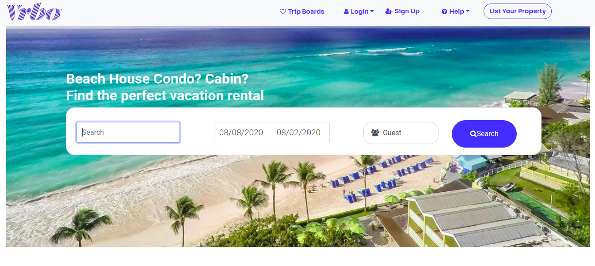

This project was created with React [Create React App](https://github.com/facebook/create-react-app).

## React Vrbo Clone

React vrbo clone is inspired from Vrbo website offering housing properties on rent for different destinations. Uses Redis and cookies for Session management. Integrated GoogleMap, Razorpay, Google sign-in and Google auto-complete.

<p></p>

**Vrbo Web link:** https://www.vrbo.com

**Vrbo clone demo:** https://vrboclone.devganesh.tech

### :wrench: Tools Used

- #### FrontEnd

  - [React](http://reactjs.org/)
  - [Redux](https://redux.js.org/)
  - [BootStrap](https://getbootstrap.com/)
  - [Styled Components](https://www.npmjs.com/package/react-responsive-carousel)
  - [Css](https://getbootstrap.com/)

- #### BackEnd
  - [Express](https://expressjs.com/)
  - [Node](https://nodejs.org/en/)
  - [MySQL](https://www.mysql.com/)
  - [Sequelize](https://sequelize.org/)
  - [Redis](https://redis.io/)
  - [AWS SES](https://aws.amazon.com/ses/)

## :v: Contributing

Great!,
after cloning & setting up the local project you can push the changes to your github fork and make a pull request.

---

**local development**

### Step 1: Clone The Repo

Fork the repository. then clone the repo locally by doing -

```bash
git clone https://github.com/pandayzyx/VrboClone.git
```

### Step 2: Install Dependencies

- #### FrontEnd

  - cd into the directory

    ```bash
    cd Frontend
    ```

    ```bash
    cd vrbo-app
    ```

  - install all the dependencies
    ```bash
    npm install
    ```

- #### BackEnd

  - cd into the directory

    ```bash
    cd Backend/
    ```

  - install VrboAuthServer dependencies

    ```bash
    cd vrboAuthServer/
    npm install
    ```

  - install VrboServer dependencies
    ```bash
    cd ../vrboServer/
    npm install
    ```

### Step 3: Start Development Server

- Create a .env file and define the environment variables as mention in the sampleenv file for both VrboAuthServer and VrboServer in their respective folders.
  <br>

- Then start the development Server in Frontend/vbro-app/ Folder

  ```
  npm start
  ```

After running the development server the site should be running on https://localhost:3000

## Deployment


### Dependecies

- #### FrontEnd

  1. react-elastic-carousel
  2. react-google-login
  3. email-validator
  4. password-validator
  5. query-string
  6. react-google-map
  7. react date-time parser
  8. react-airbnb date-picker
  9. Moment js
  10. google-autocomplte
  11. react-ga

- #### BackEnd

  1. bcrypt
  1. cookie-parser
  1. dotenv
  1. express
  1. express-validator
  1. jsonwebtoken
  1. morgan
  1. mysql2
  1. redis
  1. sequelize
  1. aws-sdk
  1. razorpay
  1. sequelize
  1. sequelize-cli
  1. twilio

## Folder structure

- #### FrontEnd

  ```bash
  .
  ├── package.json
  ├── package-lock.json
  ├── public
  │   ├── bookingpage.png
  │   ├── entity.png
  │   ├── home.png
  │   ├── index.html
  │   ├── logo192.png
  │   ├── logo512.png
  │   ├── manifest.json
  │   └── robots.txt
  ├── sampleenv
  └── src
      ├── App.css
      ├── App.js
      ├── App.test.js
      ├── Components
      │   └── CommonComponents
      │       ├── Cards
      │       │   ├── HelpCard
      │       │   │   └── HelpCard.jsx
      │       │   ├── HomeCard
      │       │   │   ├── HomeCard2.jsx
      │       │   │   ├── HomeCard2.module.css
      │       │   │   └── HomeCard.jsx
      │       │   └── ListingCards
      │       │       └── ListingCard.jsx
      │       ├── CheckBox
      │       │   └── CheckBox.jsx
      │       ├── Footer
      │       │   ├── Footer.jsx
      │       │   └── footer.module.css
      │       ├── Help
      │       │   └── Help.jsx
      │       ├── Navbar
      │       │   ├── Modals
      │       │   │   ├── OwnerLoginModal
      │       │   │   │   └── OwnerLoginModal.jsx
      │       │   │   ├── SignupModal
      │       │   │   │   └── SignUpModal.jsx
      │       │   │   └── TravellerLoginModal
      │       │   │       └── TravellerLoginModal.jsx
      │       │   ├── Navbar.jsx
      │       │   └── navbar.module.css
      │       ├── Pagination
      │       │   └── Pagination.jsx
      │       └── ReactMap
      │           ├── EntityMap.jsx
      │           └── ReactMap.jsx
      ├── data.json
      ├── index.css
      ├── index.js
      ├── Redux
      │   ├── axiosInstance.js
      │   ├── Booking
      │   │   ├── action.js
      │   │   ├── actionTypes.js
      │   │   └── bookingreducer.js
      │   ├── configureStore.js
      │   ├── Entity
      │   │   ├── action.js
      │   │   ├── actionTypes.js
      │   │   └── entityreducer.js
      │   ├── Listing
      │   │   ├── action.js
      │   │   ├── actionTypes.js
      │   │   └── listingreducer.js
      │   ├── LoginUser
      │   │   ├── action.js
      │   │   ├── actionType.js
      │   │   └── loginreducer.js
      │   └── RegisterUser
      │       ├── action.js
      │       ├── actionType.js
      │       └── registerreducer.js
      ├── Router
      │   ├── PublicRouter.jsx
      │   └── RouterComponents
      │       ├── BookingPage.jsx
      │       ├── entity.module.css
      │       ├── EntityPage.jsx
      │       ├── Home.jsx
      │       ├── home.module.css
      │       ├── ListingPage.jsx
      │       ├── NavBarRoutes
      │       │   ├── ListYourProperty.jsx
      │       │   ├── navbar.module.css
      │       │   ├── OwnerHelp.jsx
      │       │   ├── PropertManagerHelp.jsx
      │       │   ├── TravelerHelp.jsx
      │       │   ├── travelerhelp.module.css
      │       │   ├── TripBoards.jsx
      │       │   ├── TrustAndSafety.jsx
      │       │   └── trustandsafety.module.css
      │       └── PaymentSuccess.jsx
      ├── serviceWorker.js
      └── setupTests.js

  ```

- #### BackEnd

  ```bash
  .
  ├── vrboAuthServer
  │   ├── app
  │   │   ├── controller
  │   │   │   ├── fbOauthController.js
  │   │   │   ├── googleOauthController.js
  │   │   │   └── trandAuthController.js
  │   │   ├── customMiddlewares
  │   │   │   └── privatizeEndpoint.js
  │   │   ├── model
  │   │   │   ├── OauthInfosModel.js
  │   │   │   └── UserModel.js
  │   │   └── routes
  │   │       ├── index.js
  │   │       ├── oauth
  │   │       │   ├── fbOauthRoutes.js
  │   │       │   ├── googleOauthRoutes.js
  │   │       │   └── index.js
  │   │       └── trandAuthRoutes.js
  │   ├── config
  │   │   └── config.js
  │   ├── models
  │   │   ├── index.js
  │   │   ├── user.js
  │   │   └── userOauthInfo.js
  │   ├── package.json
  │   ├── package-lock.json
  │   ├── README.md
  │   ├── redisInstance
  │   │   └── index.js
  │   ├── sampleenv
  │   ├── schema.txt
  │   └── server.js
  └── vrboServer
      ├── app
      │   ├── controller
      │   │   ├── paymentController.js
      │   │   ├── propertyController.js
      │   │   ├── reviewController.js
      │   │   └── sendMailController.js
      │   ├── model
      │   │   ├── propertyGenFeaturesModel.js
      │   │   ├── propertyModel.js
      │   │   ├── propFeaturesModel.js
      │   │   ├── PropLocationsModel.js
      │   │   └── reviewModel.js
      │   └── routes
      │       ├── index.js
      │       ├── paymentRoutes.js
      │       ├── propertyRoutes.js
      │       ├── reviewRoutes.js
      │       └── sendMailRoutes.js
      ├── config
      │   └── config.js
      ├── dummyData
      │   ├── MOCK_GEN_PROP_DATA.json
      │   ├── MOCK_PROPERTY_BOOKOPTIONS_DATA.json
      │   ├── MOCK_PROPERTY_DATA.json
      │   ├── MOCK_PROPERTY_FEATURES_DATA.json
      │   ├── MOCK_PROPERTY_LOCATION_DATA.json
      │   ├── MOCK_PROPERTY_NEIGHBOURHOODS_DATA.json
      │   ├── MOCK_PROP_FEATURES_DATA.json
      │   ├── MOCK_PROP_GEO_DES_DATA.json
      │   ├── MOCK_REVIEW_DATA2.json
      │   ├── MOCK_REVIEW_DATA3.json
      │   ├── MOCK_REVIEW_DATA4.json
      │   ├── MOCK_REVIEW_DATA.json
      │   ├── MOCK_USER_PROFILE_DATA.json
      │   └── prop_gen_features.sql
      ├── models
      │   ├── Bookings.js
      │   ├── index.js
      │   ├── propBookingOptions.js
      │   ├── property.js
      │   ├── propfeatures.js
      │   ├── propGenFeatures.js
      │   ├── propGeo.js
      │   ├── propLocations.js
      │   ├── propNeighbourhoods.js
      │   ├── reviews.js
      │   └── userProfiles.js
      ├── package.json
      ├── package-lock.json
      └── server.js
  ```
